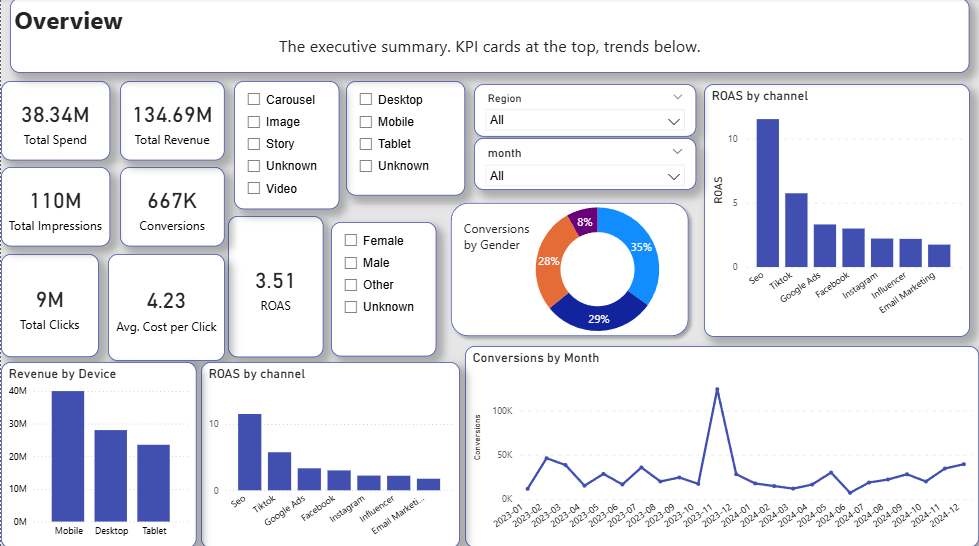
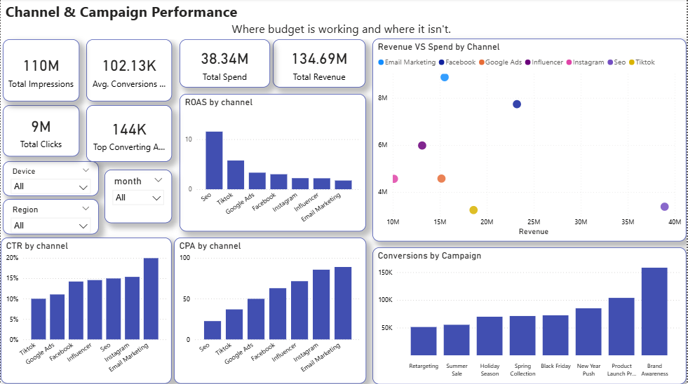
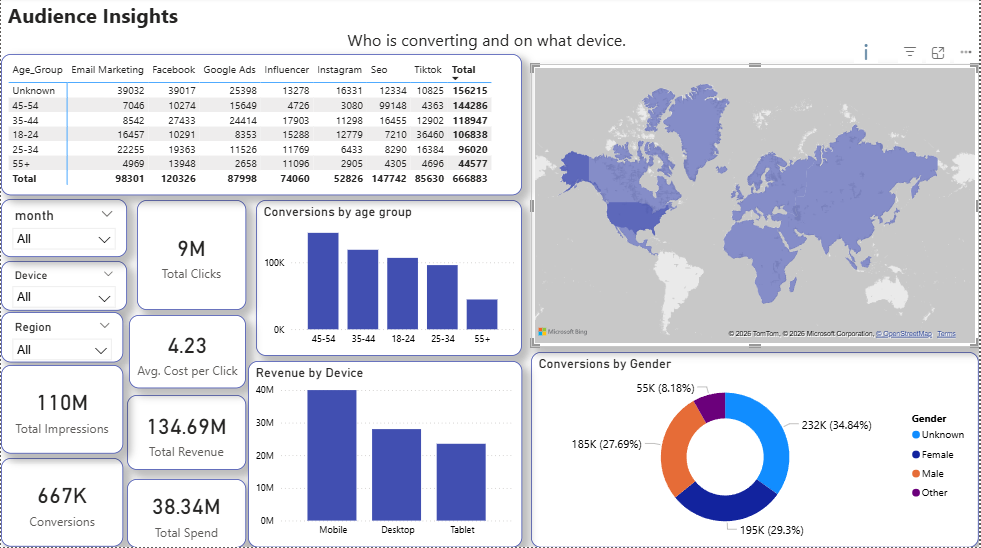

# 📊 Digital Marketing Campaign Analysis

> End-to-end marketing analytics project analyzing campaign performance across channels, regions, and audience segments — built with AI-generated data, SQL, Excel, and Power BI.

---

## 🎯 Project Objective

To analyze digital marketing campaign data and identify which channels, campaigns, and audience segments drive the highest return — giving marketing teams clear, data-backed recommendations on where to invest budget.

---

## ⚡ Key Metrics

| Metric | Value |
|---|---|
| Total Revenue | $134.69M |
| Total Spend | $38.34M |
| Overall ROAS | 4.25x |
| Total Conversions | 667K |
| Total Impressions | 110M |
| Total Clicks | 9M |
| Campaigns Tracked | 8 |
| Channels Analyzed | 7 |
| Time Period | 2023 – 2024 |

---

## 💡 Key Insights

### 1. 🔍 SEO delivers the highest ROAS at 11.5x
SEO dramatically outperforms every paid channel. For every $1 spent, it returns $11.50 — making it the most efficient channel in the mix. Budget reallocation toward SEO should be a priority.

### 2. 📱 Mobile drives the most revenue
Mobile devices generate significantly more revenue than Desktop and Tablet combined, confirming that campaigns must be mobile-first in creative and landing page design.

### 3. 🎯 Brand Awareness leads all campaigns in conversions (158K)
Despite being a top-of-funnel campaign, Brand Awareness generated the most conversions — suggesting strong audience targeting and creative performance. Product Launch Promax follows at 103K.

### 4. 👥 Age group 45-54 converts best
The 45-54 segment outperforms all other age groups in total conversions, challenging the assumption that younger audiences are the primary digital buyers in this category.

### 5. 💸 Email Marketing has the highest CPA
Email Marketing is the most expensive channel per conversion, despite relatively low spend. Creative refresh and list segmentation are needed before further investment.

### 6. 📉 TikTok shows strong ROAS (5.7x) with room to scale
TikTok's ROAS is second only to SEO, yet its total spend share remains low — indicating an underinvested channel with strong potential for scaling.

---

## 📋 Dashboards

### Overview
High-level KPIs — total revenue, spend, ROAS, and conversions. Monthly conversion trend with percent change. ROAS by channel bar chart.



### Channel & Campaign Performance
Where budget is working and where it isn't. Includes ROAS, CPA, and CTR by channel, conversions by campaign, and a Revenue vs Spend scatter plot to identify efficiency outliers.



### Audience Insights
Who is converting and on what device. Includes conversions by age group, revenue by device, conversions by gender, revenue by region, and a channel × age group matrix breakdown.



---

## 🗄️ SQL Queries

### ROAS by Channel
```sql
SELECT
    channel,
    ROUND(SUM(revenue_usd) / NULLIF(SUM(spend_usd), 0), 2) AS ROAS
FROM [marketing_project].[dbo].[campaign_data]
GROUP BY channel
ORDER BY ROAS DESC;
```

### Conversions by Campaign
```sql
SELECT
    campaign_name AS Campaign,
    SUM(conversions) AS Conversions
FROM [marketing_project].[dbo].[campaign_data]
WHERE conversions IS NOT NULL
GROUP BY campaign_name
ORDER BY Conversions DESC;
```

### Month-over-Month Conversion Trend
```sql
WITH monthly_totals AS (
    SELECT
        DATEFROMPARTS(YEAR(date), MONTH(date), 1) AS month_start,
        FORMAT(date, 'yyyy-MM') AS month,
        SUM(conversions) AS total_conversions
    FROM [marketing_project].[dbo].[campaign_data]
    WHERE conversions IS NOT NULL
    GROUP BY DATEFROMPARTS(YEAR(date), MONTH(date), 1), FORMAT(date, 'yyyy-MM')
)
SELECT
    month,
    total_conversions,
    LAG(total_conversions) OVER (ORDER BY month_start) AS previous_month,
    ROUND(
        (total_conversions - LAG(total_conversions) OVER (ORDER BY month_start)) * 100.0 /
        NULLIF(LAG(total_conversions) OVER (ORDER BY month_start), 0)
    , 1) AS percent_change
FROM monthly_totals
ORDER BY month_start;
```

### CTR by Channel
```sql
SELECT
    channel,
    ROUND(SUM(clicks) * 100.0 / NULLIF(SUM(impressions), 0), 2) AS CTR_percent
FROM [marketing_project].[dbo].[campaign_data]
GROUP BY channel
ORDER BY CTR_percent DESC;
```

### CPA by Channel
```sql
SELECT
    channel,
    ROUND(SUM(spend_usd) / NULLIF(SUM(conversions), 0), 2) AS CPA
FROM [marketing_project].[dbo].[campaign_data]
WHERE conversions IS NOT NULL
GROUP BY channel
ORDER BY CPA ASC;
```

### Revenue by Device
```sql
SELECT
    device,
    SUM(revenue_usd) AS total_revenue
FROM [marketing_project].[dbo].[campaign_data]
WHERE device != 'Unknown'
GROUP BY device
ORDER BY total_revenue DESC;
```

### Conversions by Age Group
```sql
SELECT
    age_group AS Age,
    SUM(conversions) AS total_conversions
FROM [marketing_project].[dbo].[campaign_data]
WHERE age_group != 'Unknown'
GROUP BY age_group
ORDER BY total_conversions DESC;
```

---

## 🛠️ Tools Used

| Tool | Purpose |
|---|---|
| **AI (Claude)** | Generated realistic messy dataset simulating real-world data quality issues |
| **Microsoft Excel** | Data exploration, cleaning, and standardization |
| **SQL Server / T-SQL** | Data analysis — aggregations, window functions, CTEs |
| **Power BI Desktop** | Interactive dashboards and DAX measures |
| **DAX** | Calculated measures (ROAS, CPA, CTR, total KPIs) |
| **GitHub** | Version control and portfolio showcase |

---

## 🧹 Data Cleaning Steps

The raw dataset contained the following real-world data quality issues, resolved in Excel before loading into SQL:

| Issue | Fix Applied |
|---|---|
| Inconsistent channel names (`FB`, `facebook`, `Facebook`) | Standardized to single value per channel |
| Mixed date formats (`dd/mm/yyyy`, `yyyy-MM-dd`, `Month DD, YYYY`) | Converted all to `yyyy-MM-dd` |
| Duplicate rows (~3% of records) | Removed using Excel deduplication |
| Null values in Clicks, Conversions, Spend, Revenue | Retained as NULL — filtered in queries with `IS NOT NULL` |
| Impossible values (Clicks > Impressions, negative Impressions) | Flagged and removed |
| Abbreviations mixed with full names (`M/F` vs `Male/Female`) | Standardized to full names |

---

## 📁 Project Structure

```
/
├── data/
│   ├── marketing_campaign_data_raw.csv       # Original AI-generated dataset
│   └── marketing_campaign_data_cleaned.xlsx  # Cleaned version from Excel
├── sql/
│   ├── roas_by_channel.sql
│   ├── conversions_by_campaign.sql
│   ├── monthly_trend.sql
│   ├── ctr_by_channel.sql
│   ├── cpa_by_channel.sql
│   ├── revenue_by_device.sql
│   └── conversions_by_age_group.sql
├── dashboards/
│   └── marketing_analysis.pbix              # Power BI file
├── screenshots/
│   ├── overview.png
│   ├── channel_campaign.png
│   └── audience.png
└── README.md
```

---

## ✅ Recommendations

| # | Recommendation |
|---|---|
| 1 | **Scale SEO investment** — 11.5x ROAS is far above any paid channel. Increase content and organic search budget before adding spend to paid channels. |
| 2 | **Prioritize mobile-first creative** — Mobile drives the most revenue. All ad creatives and landing pages should be designed for mobile before desktop. |
| 3 | **Audit Email Marketing** — Highest CPA in the channel mix. Run A/B tests on subject lines, list segmentation, and send timing before next campaign. |
| 4 | **Scale TikTok spend** — 5.7x ROAS with low current spend suggests this is an underinvested channel with strong growth potential. |
| 5 | **Target 45-54 age group more aggressively** — This segment converts best yet may not be the primary audience for current creative. Align messaging to this demographic. |
| 6 | **Replicate Brand Awareness campaign structure** — Highest conversions of any campaign. Analyze its targeting, creative, and timing and apply to underperforming campaigns. |

---

## 🎬 Skills Demonstrated

- Data generation and quality assessment
- Data cleaning and standardization (Excel)
- Relational database querying (SQL Server)
- Window functions, CTEs, aggregations (T-SQL)
- DAX measure creation (Power BI)
- Multi-tab interactive dashboard design
- Business insight communication

---
### Contact & Connect
* **LinkedIn:** [Ayman Djemoui](https://www.linkedin.com/in/ayman-djemoui-249286126/)
* **GitHub Portfolio:** [ayman4data](https://github.com/ayman4data)
---

*Built with Excel · SQL Server · Power BI | Data: AI-generated (2023–2024) | 7 channels · 8 campaigns · 667K conversions*
